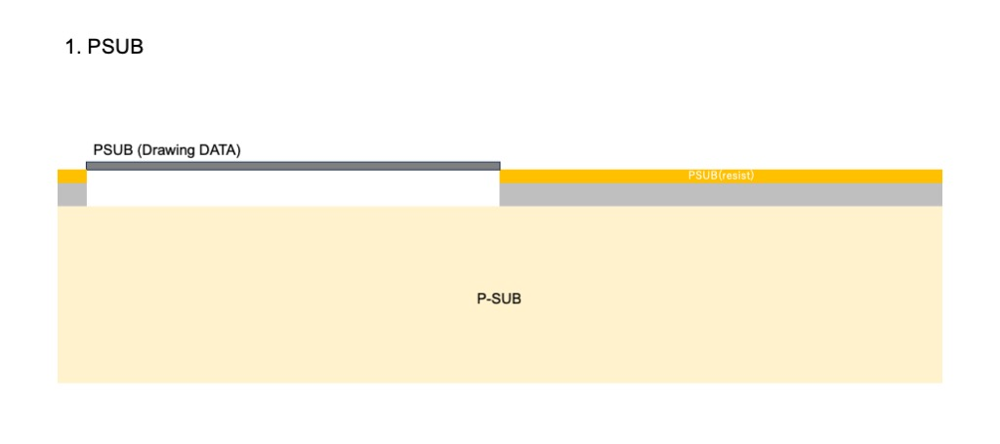
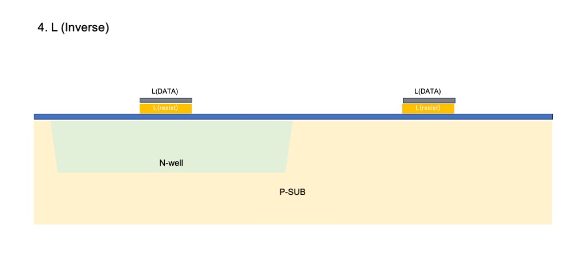
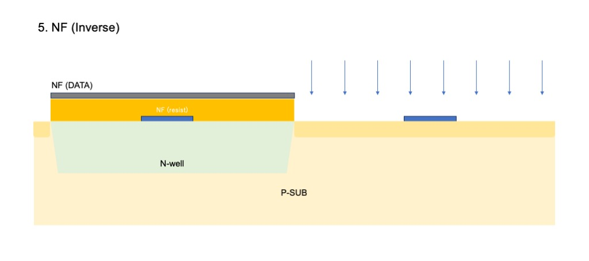
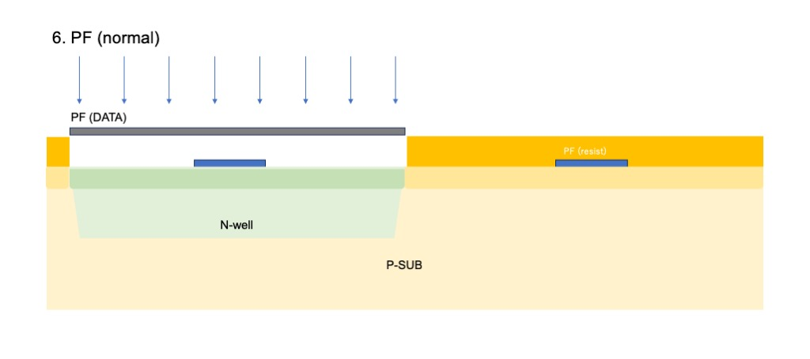
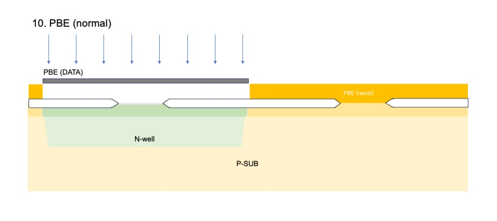
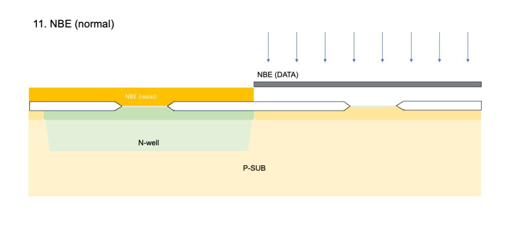
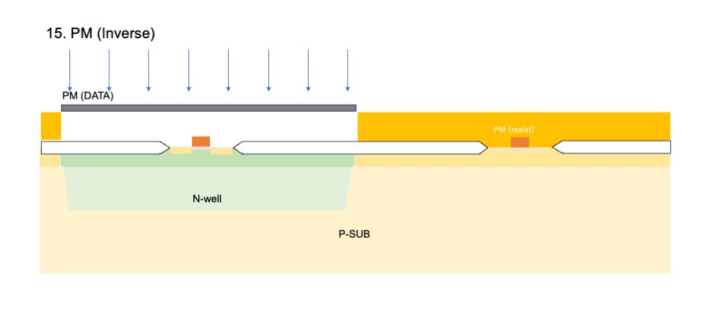
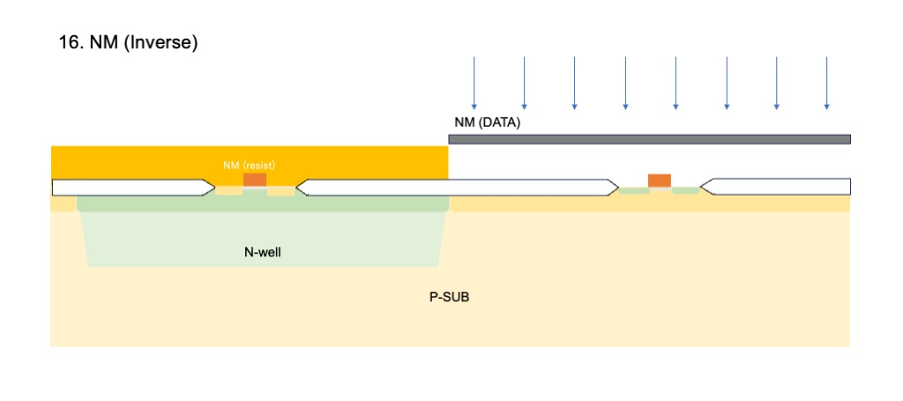
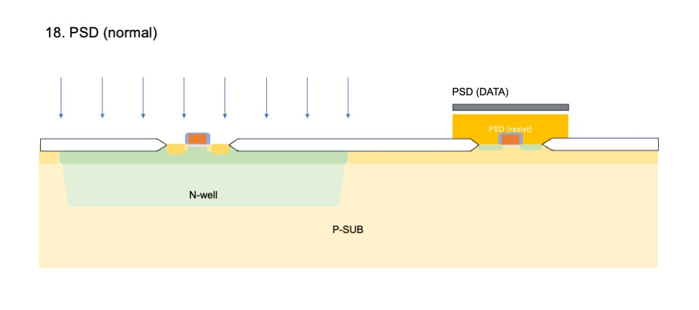
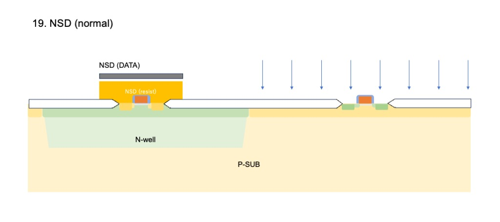

## Preface: run.drc

It seems **run.drc** file is cached in the KLayout once it is launched, so it has to be edited in the tools for debugging. It is not a convenient way, and it should be much easier to split it into each of check categories, like layer-based, to edit. So my **run.drc** only includes **report** for output and a couple of **# %include** commands, as shown below.

```
report("TR-1um DRC",  $output)
#----
# %include 00_Layers.drc
# %include 01_Basics.drc
# %include 02_Device.drc
# %include 03_Check.drc
# %include 04_Check.drc
# %include 05_Check.drc
# %include 06_Check.drc
# %include 07_Check.drc
# %include 08_Check.drc
# %include 09_Check.drc
#----
```

This method allows editing each file outside the Klayout, and each DRC run reflects the changes made beforehand. Each file includes a DRC check step by step, and tries to be independent between steps and/or files, except **00_Layers.drc** and **01_Basics.drc**, which is common for loading GDSII layers and some foundational DRC checks.

### Process Steps

**IMHO** knowledge of the process steps is a fundamental requirement for DRC/LVS development beyond the check commands and grammars. Regarding TR-1um, TOKAI RIKA has not revealed it in the [document](../openIP62/IP62/Technology/doc/OS00_リファレンスマニュアル_rev1.1.pdf), but there is enough information to imagine it. Thus, I would draw each of them below, focusing on GDSII layers. One of TR-1um technology's unique features is that drawing layers in the Klayout tool is closely tied to mask layers in the process. It is suitable for learning the relationship between MASKs and process integration; however, it might be redundant given the number of masks.

#### Step 1 (PSUB)

**PSUB** is the first mask; besides the naming, it would be the mask opening for **NWELL** forming. Also, **PSUB** should serve as the alignment reference for the following couple of ion-implantation masks.



#### Step 2 and 3 (NW/HVNW)

**NW** and **HVNW** are covering **PSUB** opening for each of the NWell forming implantations since NW and HVNW should optimize their concentration profile.


Because of alignment allowance, **NW** and **HVNW** has DRC check to the **PSUB**.

#### Step 4 (L)

**L** stands for LOCOS. I prefer to say Active or AA (Active Area), but I would say **L** to avoid further confusion. This covered the MOS and other active devices.



**L** should be primary referenced mask to followed process step as it's alignment.

#### Step 5 and 6 (PF/NF)

Both **PF** and **NF** are field ion-implantation devices for device isolation, and the combination is not straightforward or simple, since **PF** is inverted and **NF** is normal data. 




Because of their combination, both have the same drawing data and are logically exactly matched to the **PSUB** area. In such case, **PF** and **NF** masks most likely can generate from **PSUB** drawing data and seems redundant in terms for drawing data wise, IMHO.

#### Step 7 to 9 (CL/HPBE/HNBE)

After LOCOS formation, **CL**, **HPBE**, and **HNBE** are the Capacitor bottom plate and each of the channel ion-implantation for High Voltage P and N MOS are processed. Those process steps are eliminated since High Voltage device are not supported in TR-1um.

#### Step 10 and 11 (PBE/NBE)

Both **PBE** and **NBE** are channel ion-implantation for tuning transistor threshold value.




#### Step 12 and 13 (HPE/RHP)

Both process steps are eliminated since High Voltage device are not supported in TR-1um.

#### Step 14 (SG)

**SG** may stand for Saliside Gate, but I would prefer to use Poly or Gate instead. This mask inverts the data and protects the RIE etching process during gate structure formation.


#### Step 15 and 16 (PM/NM)

Both **PM** and **NM** are LDD structure formations for both P and N transistors to protect against the short-channel effect.




#### Step 17 (R)

This process steps are eliminated since **RR** device is not supported in TR-1um.

#### Step 18 and 19 (PSD/NSD)

Both **PSD** and **NSD** are MOS transistor's S/D area formations, LDD area covered by side-wall of the SG gate.




#### Step 20 and 24 (CONT/M1/TC/M2/PRO)

Those metal wiring process, BEOL steps, are eliminated in this document.


